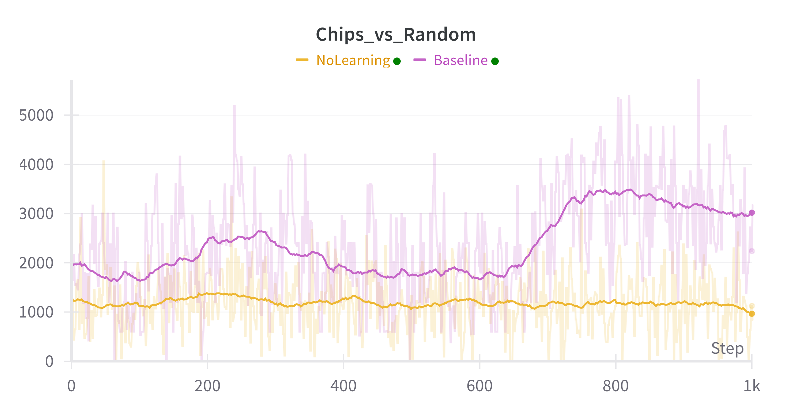

# PokerGym
**PokerGym** is a minimal, fully custom Texas Hold’em environment for multi-agent reinforcement learning.  
It is designed to support research and prototyping in imperfect information, multi-agent settings.

Built using [Gymnasium](https://gymnasium.farama.org/) and [PettingZoo](https://pettingzoo.farama.org/), the environment is compatible with standard RL tooling and supports legal action masking, side-pot logic, and full control over agent interactions.

Tournament rules follow [Poker TDA guidelines](https://www.pokertda.com/poker-tda-rules/). The RL pipeline implements Proximal Policy Optimization (PPO) as described in [OpenAI's paper](https://arxiv.org/abs/1707.06347), informed by [Daniel Bick’s thesis](https://fse.studenttheses.ub.rug.nl/25709/1/mAI_2021_BickD.pdf).

---

## Installation

```bash
pip install -r requirements.txt         # Core dependencies  
pip install -r requirements-dev.txt     # Optional: test/dev tools
```


## Features
- Turn-based Texas Hold’em engine with full continuous betting logic
- Legal action masking for RL agents
- Deterministic and random baseline agents
- PPO training framework (beats random agent)
- Unit-tested game logic

## Development Status
| Component                 | Status |
| -------------------       | ------ |
| Core game engine          | ✔      |
| Side-pot resolution       | ✔      |
| Baseline agents           | ✔      |
| More Deterministic Agents | ☐      |
| Basic PPO agent           | ✔      |
| Imporved PPO Agent        | ☐      |
| Basic Test coverage       | ✔      |
| Full Test coverage        | ☐      |
| Standardized Game Logs    | ☐      |
| Script Player V PPO Agent | ☐      |


## Usage
### Training a PPO Agent
All training parameters are configurable via the `Config` class in `pokergym/rl/ppo/training.py`.
To train a PPO agent, run:
```bash
python pokergym/rl/ppo/training.py
```

## Examples
### Poker Environment Visualization
```bash
Round: 5, Betting: FLOP, Pot: 50, Player: 5
Community Cards: [8♦][A♦][2♠]
ID  | Out | Chips  | Pos |  Cards   |  Bet   | Contrib | F | All | Action | Score |         Hand        
--------------------------------------------------------------------------------------------------------
 0  |  ✓  |    970 | SB  | [Q♦][K♠] |      0 |      10 | ✓ |  ✕  |        | 6214  | High Card           
 1  |  ✕  |    120 | BB  | [J♣][Q❤] |      0 |      20 | ✕ |  ✕  |        | 6370  | High Card           
 2  |  ✓  |      0 |     |          |      0 |       0 | ✕ |  ✕  |        |  N/A  | N/A                 
 3  |  ✓  |   4636 |     | [7♣][7♦] |      0 |       0 | ✓ |  ✕  |        | 4910  | Pair                
 4  |  ✓  |      0 |     |          |      0 |       0 | ✕ |  ✕  |        |  N/A  | N/A                 
 5  |  ✕  |    224 |     | [6❤][6♣] |      0 |      20 | ✕ |  ✕  |        | 5130  | Pair 
 ```

### Performance over Baseline
Average chips for player 0 over 1000 tournaments, compared to a random agent.

